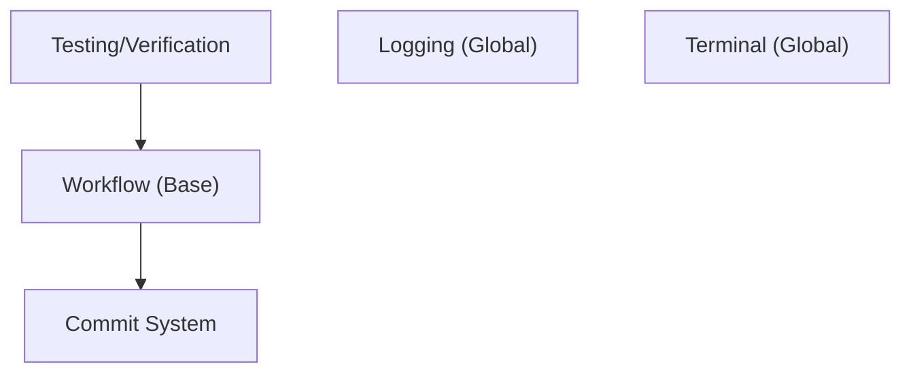

# Rule Dependency Graph

- **Global Rules**: Every task intent will load these for system health.
- **Local Rules**: Loaded based on detected intent.
- **Dependencies**: Ensuring prerequisite behavior is available.
